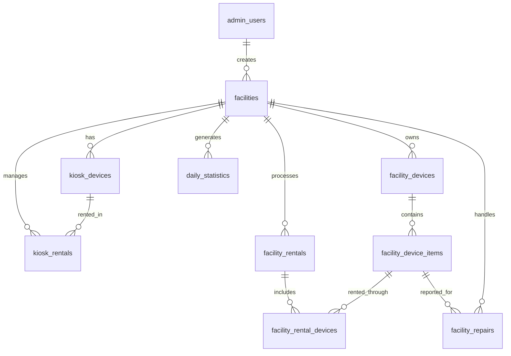

# 📊 가치봄플러스 통합 시스템 ERD

## 1. 시스템 개요

가치봄플러스 시스템은 크게 3개의 독립적인 시스템으로 구성됩니다:
- **키오스크 시스템**: 영화관 현장의 장비 대여/반납 자동화
- **전체관리자 시스템**: 한국시각장애인연합회의 전체 시스템 관리
- **시설관리자 시스템**: 100개 네트워크별 독립적인 장비 관리

## 2. 데이터베이스 테이블 구조

### 2.1 공통 테이블 (전체 시스템 공유)

#### 📌 admin_users (전체관리자 계정)
| 컬럼명 | 데이터 타입 | 제약조건 | 설명 |
|--------|------------|----------|------|
| id | INT | PK, AUTO_INCREMENT | 관리자 ID |
| username | VARCHAR(50) | UNIQUE, NOT NULL | 로그인 ID |
| password | VARCHAR(255) | NOT NULL | 비밀번호 (암호화) |
| name | VARCHAR(100) | NOT NULL | 관리자 이름 |
| phone | VARCHAR(20) | | 연락처 |
| role | ENUM('super_admin', 'admin') | DEFAULT 'admin' | 권한 구분 |
| created_at | TIMESTAMP | DEFAULT CURRENT_TIMESTAMP | 생성일시 |
| updated_at | TIMESTAMP | ON UPDATE CURRENT_TIMESTAMP | 수정일시 |
| is_active | BOOLEAN | DEFAULT TRUE | 활성화 여부 |

#### 📌 facilities (시설 정보)
| 컬럼명 | 데이터 타입 | 제약조건 | 설명 |
|--------|------------|----------|------|
| id | INT | PK, AUTO_INCREMENT | 시설 ID |
| facility_code | VARCHAR(50) | UNIQUE, NOT NULL | 시설 코드 |
| facility_name | VARCHAR(200) | NOT NULL | 시설명 |
| username | VARCHAR(50) | UNIQUE, NOT NULL | 시설관리자 로그인 ID |
| password | VARCHAR(255) | NOT NULL | 시설관리자 비밀번호 |
| manager_name | VARCHAR(100) | | 담당자명 |
| manager_phone | VARCHAR(20) | | 담당자 연락처 |
| address | TEXT | | 시설 주소 |
| created_by | INT | FK → admin_users(id) | 생성한 관리자 |
| created_at | TIMESTAMP | DEFAULT CURRENT_TIMESTAMP | 생성일시 |
| updated_at | TIMESTAMP | ON UPDATE CURRENT_TIMESTAMP | 수정일시 |
| is_active | BOOLEAN | DEFAULT TRUE | 활성화 여부 |

### 2.2 키오스크 전용 테이블 (키오스크 + 전체관리자)

#### 🎯 kiosk_devices (키오스크 장비)
| 컬럼명 | 데이터 타입 | 제약조건 | 설명 |
|--------|------------|----------|------|
| id | INT | PK, AUTO_INCREMENT | 장비 ID |
| device_serial | VARCHAR(100) | UNIQUE, NOT NULL | 시리얼 번호 |
| device_type | ENUM('AR_GLASS', 'BONE_CONDUCTION', 'SMARTPHONE') | NOT NULL | 장비 유형 |
| model_name | VARCHAR(100) | | 모델명 |
| facility_id | INT | FK → facilities(id) | 소속 시설 |
| status | ENUM('available', 'rented', 'maintenance', 'broken') | DEFAULT 'available' | 장비 상태 |
| registration_date | DATE | | 등록일 |
| last_maintenance_date | DATE | | 최근 점검일 |
| notes | TEXT | | 비고 |
| created_at | TIMESTAMP | DEFAULT CURRENT_TIMESTAMP | 생성일시 |
| updated_at | TIMESTAMP | ON UPDATE CURRENT_TIMESTAMP | 수정일시 |

#### 🎯 kiosk_rentals (키오스크 대여 기록)
| 컬럼명 | 데이터 타입 | 제약조건 | 설명 |
|--------|------------|----------|------|
| id | INT | PK, AUTO_INCREMENT | 대여 ID |
| rental_number | VARCHAR(50) | UNIQUE, NOT NULL | 대여 번호 |
| device_id | INT | FK → kiosk_devices(id) | 장비 ID |
| facility_id | INT | FK → facilities(id) | 시설 ID |
| renter_name | VARCHAR(100) | NOT NULL | 대여자명 |
| renter_phone | VARCHAR(20) | NOT NULL | 대여자 연락처 |
| rental_datetime | DATETIME | NOT NULL | 대여 일시 |
| expected_return_datetime | DATETIME | | 반납 예정일시 |
| actual_return_datetime | DATETIME | | 실제 반납일시 |
| status | ENUM('rented', 'returned', 'overdue') | DEFAULT 'rented' | 대여 상태 |
| notes | TEXT | | 비고 |
| created_at | TIMESTAMP | DEFAULT CURRENT_TIMESTAMP | 생성일시 |
| updated_at | TIMESTAMP | ON UPDATE CURRENT_TIMESTAMP | 수정일시 |

### 2.3 시설관리자 독립 테이블 (시설관리자 웹페이지 전용)

#### 🏢 facility_devices (시설별 장비 관리)
| 컬럼명 | 데이터 타입 | 제약조건 | 설명 |
|--------|------------|----------|------|
| id | INT | PK, AUTO_INCREMENT | 레코드 ID |
| facility_id | INT | FK → facilities(id) | 시설 ID |
| device_type | ENUM('AR글라스', '골전도 이어폰', '스마트폰') | NOT NULL | 장비 유형 |
| total_quantity | INT | DEFAULT 0 | 총 수량 |
| available_quantity | INT | DEFAULT 0 | 대여 가능 수량 |
| rented_quantity | INT | DEFAULT 0 | 대여중 수량 |
| broken_quantity | INT | DEFAULT 0 | 고장 수량 |
| memo | TEXT | | 메모 |
| created_at | TIMESTAMP | DEFAULT CURRENT_TIMESTAMP | 생성일시 |
| updated_at | TIMESTAMP | ON UPDATE CURRENT_TIMESTAMP | 수정일시 |

#### 🏢 facility_device_items (개별 장비 상세)
| 컬럼명 | 데이터 타입 | 제약조건 | 설명 |
|--------|------------|----------|------|
| id | INT | PK, AUTO_INCREMENT | 장비 개별 ID |
| facility_device_id | INT | FK → facility_devices(id) | 장비 관리 ID |
| device_code | VARCHAR(100) | UNIQUE, NOT NULL | 장비 코드 |
| serial_number | VARCHAR(100) | | 시리얼 번호 |
| status | ENUM('available', 'rented', 'broken', 'maintenance') | DEFAULT 'available' | 상태 |
| registration_date | DATE | | 등록일 |
| notes | TEXT | | 비고 |
| created_at | TIMESTAMP | DEFAULT CURRENT_TIMESTAMP | 생성일시 |
| updated_at | TIMESTAMP | ON UPDATE CURRENT_TIMESTAMP | 수정일시 |

#### 🏢 facility_rentals (시설 대여/반납 기록)
| 컬럼명 | 데이터 타입 | 제약조건 | 설명 |
|--------|------------|----------|------|
| id | INT | PK, AUTO_INCREMENT | 대여 ID |
| facility_id | INT | FK → facilities(id) | 시설 ID |
| rental_date | DATE | NOT NULL | 대여일 |
| rental_weekday | VARCHAR(10) | NOT NULL | 대여요일 |
| rental_type | ENUM('개인', '단체') | NOT NULL | 대여 유형 |
| borrower_name | VARCHAR(100) | NOT NULL | 대여자 이름 |
| borrower_phone | VARCHAR(20) | NOT NULL | 핸드폰번호 |
| organization_name | VARCHAR(200) | | 단체명 (단체시) |
| gender | ENUM('남성', '여성', '기타') | NOT NULL | 성별 |
| region | VARCHAR(100) | NOT NULL | 지역 (시/도) |
| residence | VARCHAR(200) | NOT NULL | 거주지 (상세) |
| age_group | ENUM('10대', '20대', '30대', '40대', '50대', '60대', '70대이상') | NOT NULL | 연령대 |
| rental_purpose | VARCHAR(500) | | 대여목적 |
| disability_type | VARCHAR(200) | | 장애유형 |
| return_date | DATE | NOT NULL | 반납일 |
| rental_period | INT | GENERATED (DATEDIFF+1) | 예정기간 (자동계산) |
| expected_users | INT | | 예정연인원 |
| actual_return_date | DATETIME | | 실제 반납일시 |
| status | ENUM('대여중', '반납완료', '연체') | DEFAULT '대여중' | 상태 |
| notes | TEXT | | 비고 |
| created_at | TIMESTAMP | DEFAULT CURRENT_TIMESTAMP | 생성일시 |
| created_by | VARCHAR(100) | | 등록한 관리자 |

#### 🏢 facility_rental_devices (대여 장비 상세)
| 컬럼명 | 데이터 타입 | 제약조건 | 설명 |
|--------|------------|----------|------|
| id | INT | PK, AUTO_INCREMENT | 레코드 ID |
| rental_id | INT | FK → facility_rentals(id) | 대여 ID |
| device_item_id | INT | FK → facility_device_items(id) | 장비 개별 ID |
| device_type | VARCHAR(50) | NOT NULL | 장비 유형 |
| quantity | INT | DEFAULT 1 | 수량 |
| is_returned | BOOLEAN | DEFAULT FALSE | 반납 여부 |
| return_datetime | DATETIME | | 반납 일시 |
| return_condition | VARCHAR(100) | | 반납시 상태 |
| created_at | TIMESTAMP | DEFAULT CURRENT_TIMESTAMP | 생성일시 |

#### 🏢 facility_repairs (고장신고 관리)
| 컬럼명 | 데이터 타입 | 제약조건 | 설명 |
|--------|------------|----------|------|
| id | INT | PK, AUTO_INCREMENT | 신고 ID |
| facility_id | INT | FK → facilities(id) | 시설 ID |
| device_item_id | INT | FK → facility_device_items(id) | 장비 개별 ID |
| device_type | VARCHAR(50) | NOT NULL | 장비 유형 |
| reporter_name | VARCHAR(100) | | 신고자명 |
| issue_description | TEXT | NOT NULL | 고장 증상 |
| status | ENUM('수리접수', '수리중', '수리완료') | DEFAULT '수리접수' | 처리 상태 |
| repair_start_date | DATETIME | | 수리 시작일 |
| repair_end_date | DATETIME | | 수리 완료일 |
| repair_cost | DECIMAL(10, 2) | | 수리 비용 |
| repair_notes | TEXT | | 수리 내역 |
| created_at | TIMESTAMP | DEFAULT CURRENT_TIMESTAMP | 생성일시 |
| updated_at | TIMESTAMP | ON UPDATE CURRENT_TIMESTAMP | 수정일시 |

### 2.4 코드 테이블 (마스터 데이터)

#### 📋 region_codes (지역 코드)
| 컬럼명 | 데이터 타입 | 제약조건 | 설명 |
|--------|------------|----------|------|
| id | INT | PK, AUTO_INCREMENT | 코드 ID |
| region_code | VARCHAR(10) | UNIQUE, NOT NULL | 지역 코드 |
| region_name | VARCHAR(100) | NOT NULL | 지역명 |
| parent_code | VARCHAR(10) | | 상위 지역 코드 |
| level | INT | DEFAULT 1 | 레벨 (1:시/도, 2:시/군/구) |
| is_active | BOOLEAN | DEFAULT TRUE | 활성화 여부 |
| display_order | INT | | 표시 순서 |
| created_at | TIMESTAMP | DEFAULT CURRENT_TIMESTAMP | 생성일시 |

#### 📋 disability_types (장애유형 코드)
| 컬럼명 | 데이터 타입 | 제약조건 | 설명 |
|--------|------------|----------|------|
| id | INT | PK, AUTO_INCREMENT | 코드 ID |
| type_code | VARCHAR(20) | UNIQUE, NOT NULL | 유형 코드 |
| type_name | VARCHAR(100) | NOT NULL | 유형명 |
| category | VARCHAR(50) | | 대분류 |
| description | TEXT | | 설명 |
| is_active | BOOLEAN | DEFAULT TRUE | 활성화 여부 |
| display_order | INT | | 표시 순서 |
| created_at | TIMESTAMP | DEFAULT CURRENT_TIMESTAMP | 생성일시 |

#### 📋 rental_purposes (대여목적 코드)
| 컬럼명 | 데이터 타입 | 제약조건 | 설명 |
|--------|------------|----------|------|
| id | INT | PK, AUTO_INCREMENT | 코드 ID |
| purpose_code | VARCHAR(20) | UNIQUE, NOT NULL | 목적 코드 |
| purpose_name | VARCHAR(200) | NOT NULL | 목적명 |
| category | VARCHAR(50) | | 카테고리 |
| is_active | BOOLEAN | DEFAULT TRUE | 활성화 여부 |
| display_order | INT | | 표시 순서 |
| created_at | TIMESTAMP | DEFAULT CURRENT_TIMESTAMP | 생성일시 |

### 2.5 로그 및 통계 테이블

#### 📊 system_logs (시스템 로그)
| 컬럼명 | 데이터 타입 | 제약조건 | 설명 |
|--------|------------|----------|------|
| id | BIGINT | PK, AUTO_INCREMENT | 로그 ID |
| log_type | ENUM('login', 'logout', 'rental', 'return', 'device_register', 'error') | NOT NULL | 로그 유형 |
| system_type | ENUM('kiosk', 'admin', 'facility') | NOT NULL | 시스템 구분 |
| user_id | INT | | 사용자 ID |
| facility_id | INT | | 시설 ID |
| action | VARCHAR(255) | | 수행 작업 |
| ip_address | VARCHAR(45) | | IP 주소 |
| user_agent | TEXT | | User Agent |
| request_data | JSON | | 요청 데이터 |
| response_data | JSON | | 응답 데이터 |
| created_at | TIMESTAMP | DEFAULT CURRENT_TIMESTAMP | 생성일시 |

#### 📊 daily_statistics (일일 통계)
| 컬럼명 | 데이터 타입 | 제약조건 | 설명 |
|--------|------------|----------|------|
| id | INT | PK, AUTO_INCREMENT | 통계 ID |
| facility_id | INT | FK → facilities(id) | 시설 ID |
| stat_date | DATE | NOT NULL | 통계일자 |
| system_type | ENUM('kiosk', 'facility') | NOT NULL | 시스템 구분 |
| total_rentals | INT | DEFAULT 0 | 총 대여 건수 |
| total_returns | INT | DEFAULT 0 | 총 반납 건수 |
| ar_glass_rentals | INT | DEFAULT 0 | AR글라스 대여 |
| bone_conduction_rentals | INT | DEFAULT 0 | 골전도 대여 |
| smartphone_rentals | INT | DEFAULT 0 | 스마트폰 대여 |
| created_at | TIMESTAMP | DEFAULT CURRENT_TIMESTAMP | 생성일시 |

## 3. 테이블 관계도



## 4. 인덱스 설계

### 주요 인덱스 목록

```sql
-- 키오스크 관련
CREATE INDEX idx_kiosk_rental_status ON kiosk_rentals(status, facility_id);
CREATE INDEX idx_kiosk_rental_date ON kiosk_rentals(rental_datetime);
CREATE INDEX idx_kiosk_device_status ON kiosk_devices(status, facility_id);

-- 시설관리자 관련
CREATE INDEX idx_facility_rental ON facility_rentals(facility_id, status);
CREATE INDEX idx_facility_rental_date ON facility_rentals(rental_date);
CREATE INDEX idx_facility_rental_type ON facility_rentals(rental_type);
CREATE INDEX idx_facility_rental_return ON facility_rentals(return_date);
CREATE INDEX idx_facility_borrower ON facility_rentals(borrower_name, borrower_phone);

-- 통계 관련
CREATE INDEX idx_daily_stat ON daily_statistics(facility_id, stat_date, system_type);
CREATE INDEX idx_system_log ON system_logs(log_type, system_type, created_at);
```

## 5. 트리거 및 자동화

### 주요 트리거

```sql
-- 대여 요일 자동 설정
DELIMITER $$
CREATE TRIGGER set_rental_weekday 
BEFORE INSERT ON facility_rentals
FOR EACH ROW
BEGIN
    SET NEW.rental_weekday = 
        CASE DAYOFWEEK(NEW.rental_date)
            WHEN 1 THEN '일'
            WHEN 2 THEN '월'
            WHEN 3 THEN '화'
            WHEN 4 THEN '수'
            WHEN 5 THEN '목'
            WHEN 6 THEN '금'
            WHEN 7 THEN '토'
        END;
END$$
DELIMITER ;

-- 연체 상태 자동 업데이트
DELIMITER $$
CREATE EVENT update_overdue_status
ON SCHEDULE EVERY 1 HOUR
DO
BEGIN
    -- 키오스크 대여 연체 업데이트
    UPDATE kiosk_rentals 
    SET status = 'overdue'
    WHERE status = 'rented' 
    AND expected_return_datetime < NOW();
    
    -- 시설 대여 연체 업데이트
    UPDATE facility_rentals 
    SET status = '연체'
    WHERE status = '대여중' 
    AND return_date < CURDATE();
END$$
DELIMITER ;
```

## 6. 데이터베이스 설정 권장사항

### 6.1 Character Set & Collation
```sql
CREATE DATABASE gotogether_db 
CHARACTER SET utf8mb4 
COLLATE utf8mb4_unicode_ci;
```

### 6.2 Storage Engine
- InnoDB (트랜잭션 지원, 외래키 제약조건)

### 6.3 파티셔닝 전략
- system_logs: 월별 파티셔닝
- daily_statistics: 연도별 파티셔닝

### 6.4 백업 전략
- 일일 전체 백업
- 시간별 증분 백업
- 중요 트랜잭션 실시간 복제

## 7. 보안 고려사항

### 7.1 개인정보 보호
- 전화번호: 마스킹 처리 (010-****-****)
- 비밀번호: bcrypt 암호화
- 민감정보: AES-256 암호화

### 7.2 접근 권한
- 키오스크: 제한된 CRUD 권한
- 시설관리자: 자체 시설 데이터만 접근
- 전체관리자: 모든 데이터 접근 가능

### 7.3 감사 로그
- 모든 데이터 변경 이력 기록
- IP 주소 및 사용자 정보 저장

## 8. 성능 최적화

### 8.1 쿼리 최적화
- 복합 인덱스 활용
- 불필요한 JOIN 최소화
- 서브쿼리 대신 JOIN 사용

### 8.2 캐싱 전략
- Redis를 통한 세션 관리
- 자주 조회되는 마스터 데이터 캐싱
- 실시간 대여 현황 캐싱

### 8.3 데이터베이스 튜닝
- innodb_buffer_pool_size: 메모리의 70-80%
- max_connections: 500
- query_cache_size: 128M

## 9. 데이터 마이그레이션

### 9.1 초기 데이터
```sql
-- 지역 코드 초기 데이터
INSERT INTO region_codes (region_code, region_name, level) VALUES 
('11', '서울특별시', 1),
('21', '부산광역시', 1),
('22', '대구광역시', 1);

-- 장애유형 초기 데이터  
INSERT INTO disability_types (type_code, type_name, category) VALUES 
('V01', '전맹', '시각장애'),
('V02', '저시력', '시각장애'),
('H01', '농', '청각장애');

-- 대여목적 초기 데이터
INSERT INTO rental_purposes (purpose_code, purpose_name, category) VALUES 
('E01', '영화관람', '문화활동'),
('E02', '공연관람', '문화활동'),
('T01', '관광', '여행');
```

## 10. 모니터링 지표

### 10.1 주요 모니터링 항목
- 테이블 크기 및 증가율
- 쿼리 응답 시간
- 동시 접속자 수
- 트랜잭션 처리량
- 에러 발생률

### 10.2 알람 설정
- 연체 24시간 초과 시
- 장비 고장률 10% 초과 시
- 데이터베이스 응답시간 3초 초과 시

---